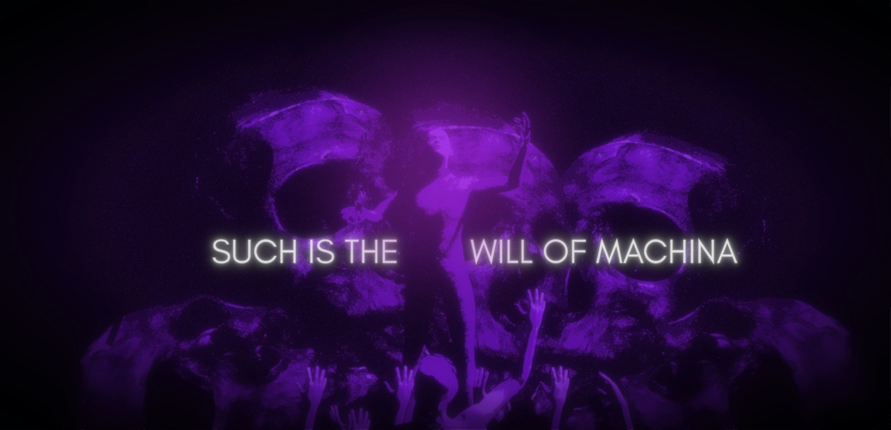

<p></p>

This project will be used as an experimental sandbox to test out generative AI technologies. We will attempt to use open-source resources and free AI tools to write and visualize a multimedia narrative.

## Story

The Tauroboros (ταυροβόρος) describes the life of a human from the future.

### Building the Books

To generate PDF files from Markdown:

```sh
make part-1-pdf
make part-2-pdf
make part-3-pdf
```

### Tools

- Blender for 3D animation and video editing
- Python for scripts

### Building the Animation

```sh
# Build the render
make render

# Build the individual voices .wav files
make voice-1 voice-2 voice-3 voice-4
```

### Dependencies

You will need the following tools to compile the documents:

- Pandoc
- Make
- LaTeX (texlive-core, texlive-fontsrecommended, texlive-binextra, texlive-bin, texlive-latex, texlive-latexextra)

## Credits

The following are es used and their licenses:

- [Coqui-ai/TTS (VCTK - VITS)](https://github.com/coqui-ai/TTS) used for voices (Apache 2.0)
- [Pandoc (GNU GPLv2)](https://en.wikipedia.org/wiki/Pandoc)

## License

The books and animation sequences are licensed under [Creative Commons Attribution-ShareAlike 4.0 International](./LICENSE). The .tex files are licensed under GPLv3. The third-party assets are licensed separately. All trademarks are property of their respective owners.
